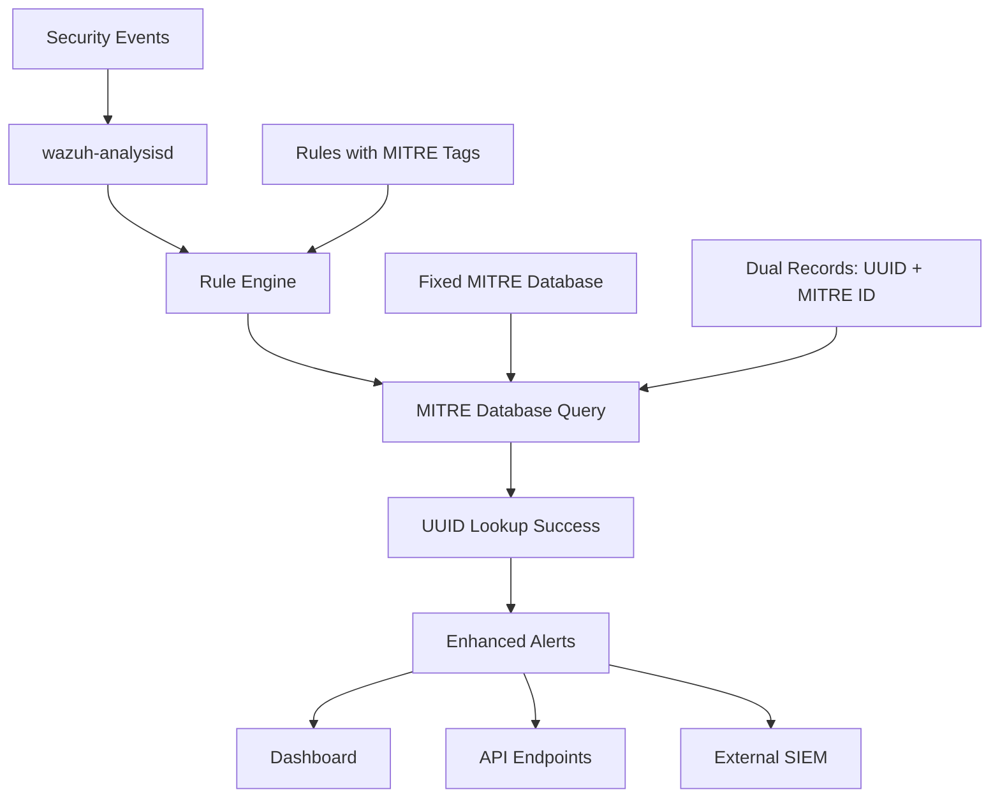

# 🔗 Wazuh Integration Guide

## 📋 Overview

Complete guide for integrating the MITRE warning fix with existing Wazuh installations, including rule development, API usage, and dashboard configuration.

---

## 🏗️ Integration Architecture

### Component Flow


### Key Integration Points
1. **wazuh-analysisd**: Direct SQLite database access
2. **Rule Engine**: MITRE technique validation
3. **Dashboard**: Visual MITRE framework
4. **API**: Programmatic access to MITRE data
5. **External Systems**: SIEM, SOAR, Threat Intel

---

## 📝 Rule Development

### MITRE-Enabled Rules

#### Basic Rule Template
```xml
<rule id="100xxx" level="10">
    <if_group>category</if_group>
    <match>specific_pattern</match>
    <description>Attack description with MITRE context</description>
    <mitre>
        <id>T1078</id>
    </mitre>
    <group>attack,mitre</group>
</rule>
```

#### Advanced Multi-Technique Rule
```xml
<rule id="100xxx" level="12">
    <if_group>authentication_success</if_group>
    <regex>brute.+force.+success</regex>
    <description>Successful authentication after brute force attack</description>
    <mitre>
        <id>T1110</id>        <!-- Brute Force -->
        <id>T1078</id>        <!-- Valid Accounts -->
        <id>T1078.002</id>    <!-- Domain Accounts -->
    </mitre>
    <group>attack,authentication,credential_access</group>
</rule>
```

#### Sub-technique Specific Rule
```xml
<rule id="100xxx" level="10">
    <if_group>windows_authentication</if_group>
    <match>pass the hash</match>
    <description>Pass the Hash attack detected</description>
    <mitre>
        <id>T1550.002</id>    <!-- Pass the Hash -->
    </mitre>
    <group>attack,credential_access,lateral_movement</group>
</rule>
```

### Rule Testing Process

#### 1. Pre-deployment Testing
```bash
# Test rule with wazuh-logtest
/var/ossec/bin/wazuh-logtest << 'EOF'
Sep 20 15:30:00 server kernel: Authentication failed for user admin from 192.168.1.100
EOF
```

#### 2. MITRE Technique Validation
```bash
# Verify technique exists in database
sqlite3 /var/ossec/var/db/mitre.db "SELECT name FROM technique WHERE id='T1078';"

# Check for UUID record (critical!)
sqlite3 /var/ossec/var/db/mitre.db "
SELECT COUNT(*) FROM technique
WHERE name=(SELECT name FROM technique WHERE id='T1078')
AND id LIKE 'attack-pattern%';"
```

#### 3. Production Deployment
```bash
# Deploy rule
echo "New rule content" >> /var/ossec/etc/rules/local_rules.xml

# Fix permissions
chown wazuh:wazuh /var/ossec/etc/rules/local_rules.xml
chmod 660 /var/ossec/etc/rules/local_rules.xml

# Test configuration
/var/ossec/bin/wazuh-control configcheck

# Restart if valid
systemctl restart wazuh-manager
```

---

## 📊 Alert Enrichment

### Enhanced Alert Structure

#### Before Fix (Warning Generated)
```json
{
    "timestamp": "2025-09-20T15:30:00.000Z",
    "rule": {
        "id": "100200",
        "level": 10,
        "description": "Brute force attack detected",
        "mitre": {}  // Empty - technique not found
    },
    "agent": {"name": "server-01"}
}
```

#### After Fix (Full Enrichment)
```json
{
    "timestamp": "2025-09-20T15:30:00.000Z",
    "rule": {
        "id": "100200",
        "level": 10,
        "description": "Brute force attack detected",
        "mitre": {
            "technique": [
                {
                    "id": "T1110",
                    "name": "Brute Force",
                    "tactic": ["Credential Access"],
                    "platform": ["Windows", "Linux", "macOS"]
                }
            ]
        }
    },
    "agent": {"name": "server-01"},
    "data": {
        "srcip": "192.168.1.100",
        "dstuser": "administrator"
    }
}
```

### MITRE Context Benefits

#### For Security Analysts
- **Standardized Language**: Common threat terminology across teams
- **Attack Context**: Understanding of broader attack methodology
- **Response Guidance**: Direct links to MITRE mitigation strategies
- **Threat Hunting**: MITRE-guided hunting hypotheses

#### For SOC Operations
- **Consistent Classification**: Uniform threat categorization
- **Automated Enrichment**: No manual MITRE lookup required
- **Executive Reporting**: High-level threat summaries
- **Compliance**: Framework-aligned security reporting

---

## 🖥️ Dashboard Configuration

### MITRE ATT&CK Module

#### Module Access
- **URL**: `https://your-wazuh-dashboard:443/app/wazuh#/overview?tab=mitre`
- **Authentication**: Standard Wazuh dashboard credentials
- **Permissions**: Requires MITRE module access

#### Key Features After Fix

##### 1. Framework Tab
- **Visual Matrix**: Interactive technique grid by tactic
- **Color Coding**: Alert frequency and severity
- **Zero Empty Cells**: All techniques properly mapped
- **Drill-down**: Click-through to specific alerts

##### 2. Intelligence Tab
- **Complete Technique Details**: Full MITRE information
- **Threat Actor Mapping**: Groups using techniques
- **Mitigation Strategies**: Defensive recommendations
- **External References**: Direct MITRE website links

##### 3. Statistics Widgets
- **Real-time Metrics**: Live technique detection counts
- **Top 10 Charts**: Most common techniques and tactics
- **Platform Distribution**: Windows/Linux/macOS breakdown
- **Timeline Views**: Technique usage trends

### Dashboard Performance

#### Optimization Settings
```javascript
// Enhanced dashboard queries (cached for performance)
const mitreQueries = {
    // Cache technique metadata for 1 hour
    techniqueMetadata: cache.get('mitre_techniques', 3600),

    // Real-time alert aggregation
    recentAlerts: `
        SELECT mitre_technique, COUNT(*) as alert_count
        FROM alerts
        WHERE timestamp > NOW() - INTERVAL 24 HOUR
        AND mitre_technique IS NOT NULL
        GROUP BY mitre_technique
        ORDER BY alert_count DESC
        LIMIT 10
    `
};
```

---

## 🔌 API Integration

### Authentication Setup
```bash
# Get API token
TOKEN=$(curl -k -s -u your-username:your-password -X POST \
    https://localhost:55000/security/user/authenticate | jq -r '.data.token')
```

### Core MITRE Endpoints

#### Get All Techniques
```bash
curl -k -s -H "Authorization: Bearer $TOKEN" \
    "https://localhost:55000/mitre/techniques" | jq '.data.total_affected_items'
# Expected: 1382 (after dual-record fix)
```

#### Get Specific Technique
```bash
curl -k -s -H "Authorization: Bearer $TOKEN" \
    "https://localhost:55000/mitre/techniques/T1078" | jq '.data.affected_items[0].name'
# Expected: "Valid Accounts"
```

#### Get Sub-techniques
```bash
curl -k -s -H "Authorization: Bearer $TOKEN" \
    "https://localhost:55000/mitre/techniques?subtechnique_of=T1078" | jq
```

### API Integration Examples

#### Python Integration
```python
import requests
import json

class WazuhMitreAPI:
    def __init__(self, base_url, username, password):
        self.base_url = base_url
        self.token = self._get_token(username, password)

    def _get_token(self, username, password):
        response = requests.post(
            f"{self.base_url}/security/user/authenticate",
            auth=(username, password),
            verify=False
        )
        return response.json()['data']['token']

    def get_technique(self, technique_id):
        headers = {"Authorization": f"Bearer {self.token}"}
        response = requests.get(
            f"{self.base_url}/mitre/techniques/{technique_id}",
            headers=headers,
            verify=False
        )
        return response.json()

    def search_techniques_by_tactic(self, tactic_name):
        headers = {"Authorization": f"Bearer {self.token}"}
        response = requests.get(
            f"{self.base_url}/mitre/techniques?tactic={tactic_name}",
            headers=headers,
            verify=False
        )
        return response.json()

# Usage example
api = WazuhMitreAPI("https://localhost:55000", "username", "password")
technique = api.get_technique("T1078")
print(f"Technique: {technique['data']['affected_items'][0]['name']}")
```

#### Bash Automation
```bash
#!/bin/bash
# MITRE API automation script

WAZUH_API="https://localhost:55000"
USERNAME="your-username"
PASSWORD="your-password"

# Get token
get_token() {
    curl -k -s -u $USERNAME:$PASSWORD -X POST \
        $WAZUH_API/security/user/authenticate | \
        jq -r '.data.token'
}

# Get technique details
get_technique() {
    local technique_id=$1
    local token=$(get_token)

    curl -k -s -H "Authorization: Bearer $token" \
        "$WAZUH_API/mitre/techniques/$technique_id" | \
        jq -r '.data.affected_items[0].name'
}

# Verify fix worked - should return technique name, not empty
echo "T1078: $(get_technique T1078)"
echo "T1484: $(get_technique T1484)"
echo "T1550.002: $(get_technique T1550.002)"
```

---

## 🔗 External System Integration

### SIEM Integration

#### Splunk Integration
```bash
# Export MITRE-enriched alerts to Splunk
curl -k -s -H "Authorization: Bearer $TOKEN" \
    "https://localhost:55000/alerts?mitre.technique=T1078&limit=100" | \
    jq '.data.affected_items[]' | \
    curl -X POST "https://splunk:8088/services/collector" \
         -H "Authorization: Splunk YOUR-HEC-TOKEN" \
         -d @-
```

#### QRadar Integration
```python
# QRadar reference data update
import requests

def update_qradar_mitre_data():
    qradar_api = "https://qradar.company.com/api"
    headers = {"SEC": "your-qradar-token"}

    # Get all techniques from Wazuh
    techniques = api.get_all_techniques()

    for technique in techniques['data']['affected_items']:
        # Add to QRadar reference collection
        payload = {
            "name": technique['id'],
            "value": technique['name'],
            "source": "Wazuh-MITRE"
        }
        requests.post(
            f"{qradar_api}/reference_data/sets/mitre_techniques",
            headers=headers,
            json=payload
        )
```

### SOAR Integration

#### Phantom/Splunk SOAR
```python
# Phantom playbook integration
def create_mitre_playbook(alert_data):
    if 'mitre' in alert_data['rule'] and alert_data['rule']['mitre']['technique']:
        techniques = alert_data['rule']['mitre']['technique']

        playbook_data = {
            'name': f"MITRE Response: {', '.join([t['name'] for t in techniques])}",
            'description': f"Automated response for MITRE techniques: {', '.join([t['id'] for t in techniques])}",
            'severity': 'high' if alert_data['rule']['level'] >= 10 else 'medium'
        }

        # Create incident in SOAR platform
        return create_phantom_incident(playbook_data)
```

### Threat Intelligence Integration

#### MISP Integration
```python
# MISP threat intelligence correlation
from pymisp import PyMISP

def correlate_with_misp(technique_id):
    misp = PyMISP('https://misp.company.com', 'your-api-key')

    # Search for events containing this MITRE technique
    events = misp.search(
        tags=[f"mitre-attack-pattern:{technique_id}"],
        published=True
    )

    return {
        'technique': technique_id,
        'related_events': len(events),
        'threat_actors': extract_threat_actors(events),
        'iocs': extract_iocs(events)
    }
```

---

## 📈 Performance Monitoring

### Integration Health Checks

#### Database Performance
```bash
# Monitor MITRE database query performance
sqlite3 /var/ossec/var/db/mitre.db << 'SQL'
.timer on
SELECT * FROM technique WHERE id='T1078';
SELECT * FROM technique WHERE id LIKE 'attack-pattern%' AND name='Valid Accounts';
.timer off
SQL
```

#### API Performance
```bash
# Test API response times
time curl -k -s -H "Authorization: Bearer $TOKEN" \
    "https://localhost:55000/mitre/techniques/T1078" > /dev/null
```

#### Rule Processing Impact
```bash
# Monitor rule processing performance
grep -E "(rules processed|events/second)" /var/ossec/logs/ossec.log | tail -5
```

### Alert Volume Analysis

#### MITRE Coverage Statistics
```bash
# Analyze MITRE technique coverage in alerts
curl -k -s -H "Authorization: Bearer $TOKEN" \
    "https://localhost:55000/alerts?limit=1000" | \
    jq '[.data.affected_items[] | select(.rule.mitre.technique != null)] | length'
```

#### Warning Elimination Verification
```bash
# Verify no MITRE warnings in logs
tail -1000 /var/ossec/logs/ossec.log | grep -i "mitre.*not found" | wc -l
# Expected: 0 (after fix)
```

---

## 🔧 Configuration Management

### Automated Deployment

#### Ansible Playbook
```yaml
---
- name: Deploy MITRE Warning Fix
  hosts: wazuh_managers
  become: yes
  tasks:
    - name: Download fixed script
      get_url:
        url: https://raw.githubusercontent.com/paolokappa/wazuh-mitre-warnings-fix/main/scripts/mitre-db-autoupdate.sh
        dest: /opt/mitre-db-autoupdate.sh
        mode: '0755'
        owner: root
        group: root

    - name: Stop wazuh-manager
      systemd:
        name: wazuh-manager
        state: stopped

    - name: Run MITRE database update
      command: /opt/mitre-db-autoupdate.sh
      register: update_result

    - name: Start wazuh-manager
      systemd:
        name: wazuh-manager
        state: started

    - name: Verify fix worked
      shell: |
        sleep 30
        tail -100 /var/ossec/logs/ossec.log | grep -i "mitre.*not found" | wc -l
      register: warning_count

    - name: Assert no warnings
      assert:
        that: warning_count.stdout|int == 0
        fail_msg: "MITRE warnings still present after fix"
```

#### Terraform Configuration
```hcl
resource "null_resource" "mitre_fix_deployment" {
  provisioner "remote-exec" {
    inline = [
      "wget -O /opt/mitre-db-autoupdate.sh https://raw.githubusercontent.com/paolokappa/wazuh-mitre-warnings-fix/main/scripts/mitre-db-autoupdate.sh",
      "chmod +x /opt/mitre-db-autoupdate.sh",
      "systemctl stop wazuh-manager",
      "/opt/mitre-db-autoupdate.sh",
      "systemctl start wazuh-manager"
    ]
  }

  triggers = {
    script_version = "2.1"
  }
}
```

---

## 🚨 Troubleshooting Integration Issues

### Common Problems

#### 1. Persistent MITRE Warnings
```bash
# Diagnosis
sqlite3 /var/ossec/var/db/mitre.db "
SELECT
  COUNT(*) FILTER (WHERE id LIKE 'T%') as mitre_ids,
  COUNT(*) FILTER (WHERE id LIKE 'attack-pattern%') as uuids
FROM technique;"

# Expected: mitre_ids=691, uuids=691
# If uuids=0: Script didn't create UUID records
```

#### 2. API Endpoints Not Working
```bash
# Test API connectivity
curl -k -s -H "Authorization: Bearer $TOKEN" \
    "https://localhost:55000/mitre/techniques?limit=1"

# Check for database locks
lsof | grep mitre.db
```

#### 3. Dashboard Module Issues
```bash
# Check dashboard module status
systemctl status wazuh-dashboard

# Verify module configuration
grep -r "mitre" /usr/share/wazuh-dashboard/
```

---

**Document Version**: 1.0
**Created**: September 20, 2025
**Integration Status**: Complete with dual-record fix
**Compatibility**: Wazuh 4.10+, MITRE ATT&CK v17.1